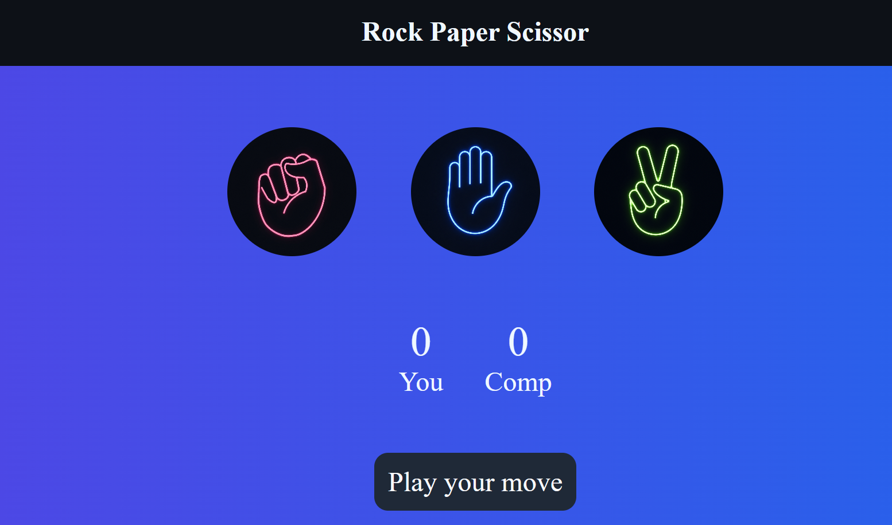
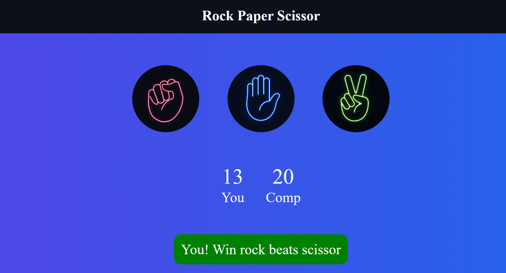
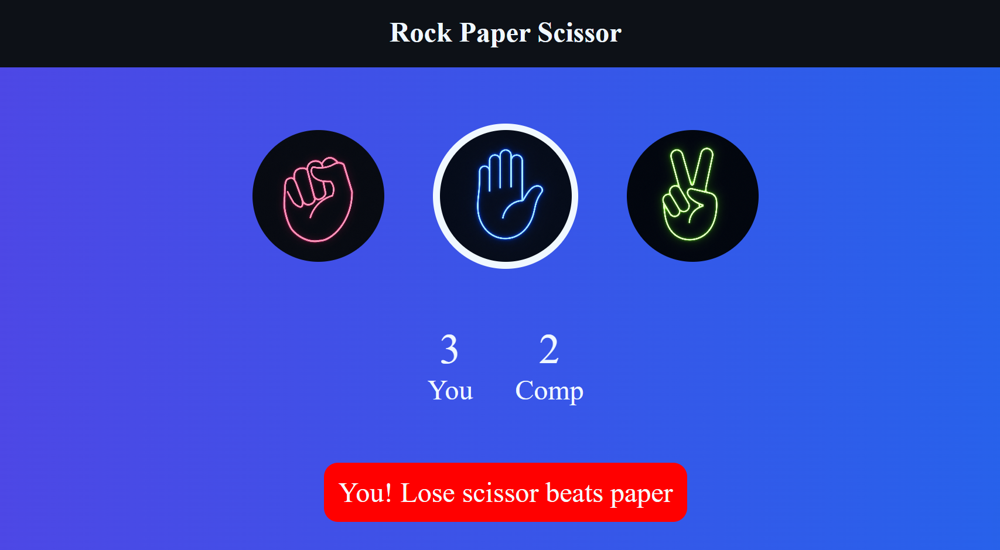
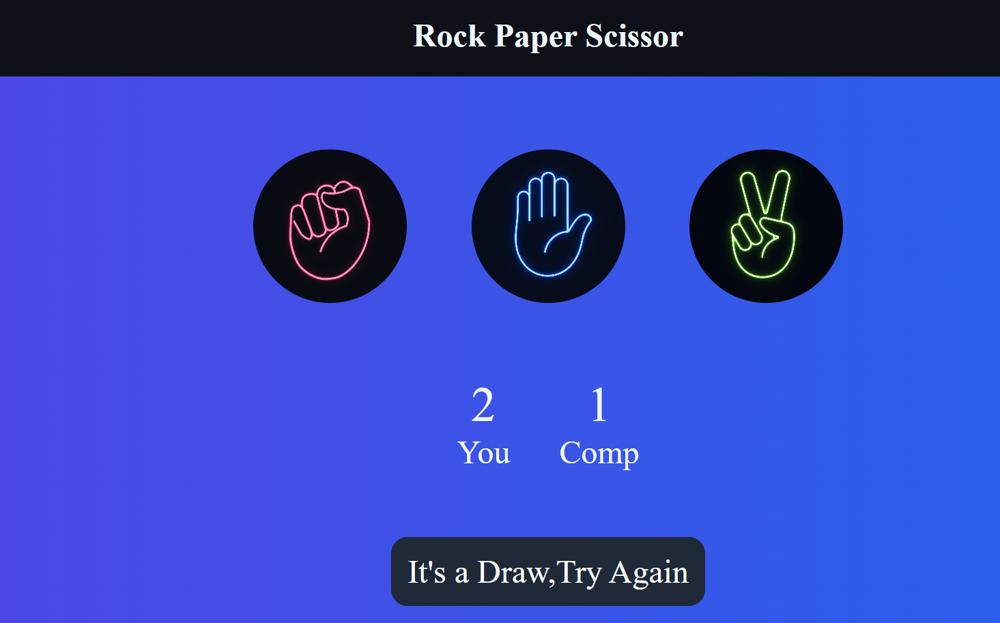

# 🎮 Rock Paper Scissors

A classic Rock Paper Scissors game built using HTML, CSS, and JavaScript.

## 🚀 Features

- Play against the computer
- Random computer moves
- Live score tracking
- Win/Lose/Draw messages
- Responsive design
- Neon-themed UI

## 🛠️ Technologies Used

- HTML5
- CSS3
- JavaScript

## 📸 Screenshots

### Home


### Winning


### Losing


### Draw


## ▶️ Run Locally

Clone the repository:

```bash
git clone https://github.com/rohitkumawat-devs/rock-paper-scissors.git
```

Open `index.html` in your browser.

## 👨‍💻 Author

Rohit Kumawat
